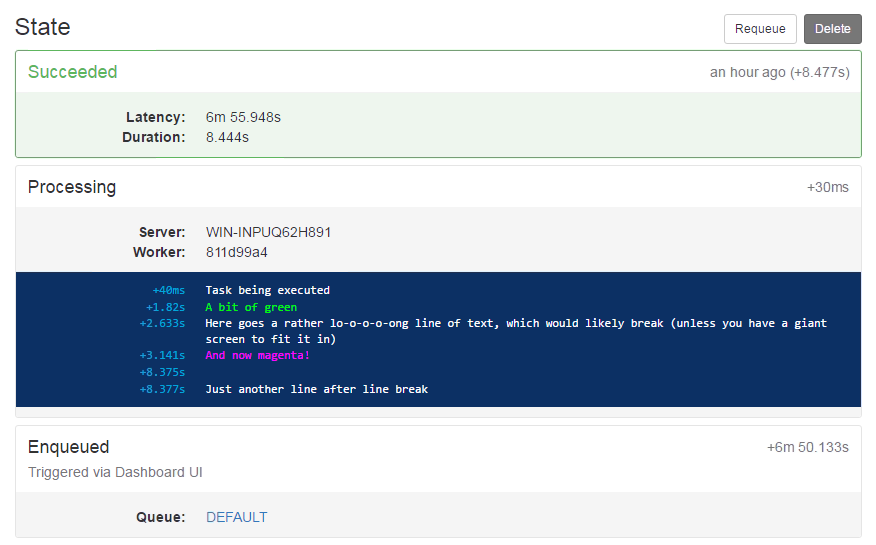
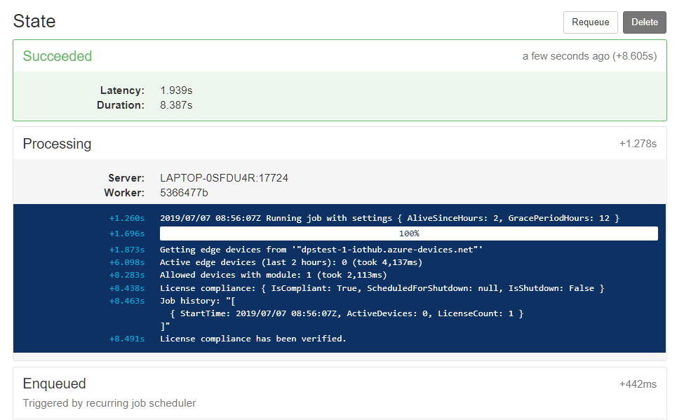

Working with a service using Hangfire ([hangfire.io](https://www.hangfire.io)) recently, I was using the fantastic Hangfire.Console package ([github](https://github.com/pieceofsummer/Hangfire.Console)) to get log output directly into the job status page rather than keeping it only in.. well, the logs.

It looks like this:


At first I was doing the usual &ldquo;just have two lines of code for every log statement&rdquo; but ofcourse that didn't last long as I wanted to record logs from other components and rather than just from the job code itself. The answer is a Serilog sink that can dump logs into the console for whichever job is executing.

The general method for passing context like this in Serilog is with context properties: the `ForContext` overloads can take information and return a logger instance where the info is included.

```csharp
using Serilog;
// ...
var logger = Log.ForContext<MyImplementation>()
    .ForContext("JobId", context.BackgroundJob.Id)

logger.Information("Now comes with the JobId property attached: {JobId}");
```

Writing a sink would be trivial if there was a way to just get the Console for a given job, but there's not. Instead, the Hangfire.Console adds an extension method to write log entries:

```csharp
private async Task RunAsync(PerformContext context)
{
    // Writing to the job console like this..
    context.WriteLine("My log entry");
}
```

Serilog cannot do this with only configuration, so we have to add a bit. I am going to show a couple of ways to do this.

# Context passing

One package that is very related, and would make it very easy is Serilog.Sinks.Map ([github](https://github.com/serilog/serilog-sinks-map)). It can take, say, a filename as a context and write to it: ```lc.WriteTo.Map("Name", "Other", (name, wt) => wt.File($"./logs/log-{name}.txt"))```. However, it can only pull *strings* out of the Serilog context.

This is not the fault of Serilog.Sinks.Map. Objects given as context are converted to a string representation and you can't go back to the original reference after. This makes sense for Serilog, as it has to be concerned about objects getting disposed.

The solution is to write a Serilog Enricher (`ILogEventEnricher`) and use a custom `LogEventPropertyValue` that keeps track of our object reference.

## A bunch of code

Our new internal classes for Serilog to use:

```csharp
internal class PerformContextValue : LogEventPropertyValue
{
    public PerformContext PerformContext { get; set; }

    /// <inheritdoc />
    public override void Render(TextWriter output, string format = null, IFormatProvider formatProvider = null)
    {
        // This is how the PerformContext will be rendered in Json output, etc.
        output.Write(PerformContext.BackgroundJob.Id);
    }
}

internal class HangfireConsoleSerilogEnricher : ILogEventEnricher
{
    public PerformContext PerformContext { get; set; }

    /// <inheritdoc />
    public void Enrich(LogEvent logEvent, ILogEventPropertyFactory propertyFactory)
    {
        // Create our PerformContextValue with the stored PerformContext reference.
        var prop = new LogEventProperty(
            "PerformContext", new PerformContextValue {PerformContext = PerformContext}
        );
        logEvent.AddOrUpdateProperty(prop);
    }
}
```

The Serilog Sink has to be written to only handle our own type of log events.

```csharp
public class HangfireConsoleSink : ILogEventSink
{
    /// <inheritdoc />
    public void Emit(LogEvent logEvent)
    {
        if (logEvent.Properties.TryGetValue("PerformContext", out var logEventPerformContext))
        {
            // Try to get PerformContext as our property value
            var performContext = (logEventPerformContext as PerformContextValue)?.PerformContext;
            performContext?.WriteLine(GetColor(logEvent.Level), logEvent.RenderMessage());
        }

        ConsoleTextColor GetColor(LogEventLevel level)
        {
            switch (level)
            {
                case LogEventLevel.Fatal:
                case LogEventLevel.Error:
                    return ConsoleTextColor.Red;
                case LogEventLevel.Warning:
                    return ConsoleTextColor.Yellow;
                case LogEventLevel.Information:
                    return ConsoleTextColor.White;
                case LogEventLevel.Verbose:
                case LogEventLevel.Debug:
                    return ConsoleTextColor.Gray;
                default:
                    throw new ArgumentOutOfRangeException();
            }
        }
    }
}
```

That done, we set up the logger configuration to write to the new Sink:

```csharp
Log.Logger = new LoggerConfiguration()
    .WriteTo.Sink(new HangfireConsoleSink())
    .CreateLogger();
```

## Usage from  a job

Using an extension method for converting a context to a logger:

```csharp
public static class HangfireConsoleSinkExtensions
{
    public static ILogger CreateLoggerForPerformContext<T>(this PerformContext context)
    {
        return Log.ForContext<T>()
            .ForContext(new HangfireConsoleSerilogEnricher {PerformContext = context});
    }
}
```

And use from the call site like so:

```csharp
private async Task RunAsync(PerformContext context)
{
    var logger = context.CreateLoggerForPerformContext<MyImplementation>();

    logger.Information("This goes to the job console automatically");

    // Pass the logger through to components manually.
    _myServiceImplementation.SomeMethodCall(log: logger);
}
```

## Result

The result is that the job will now pick up whatever is written to the logger and spit it out as formatted by Serilog:


# Skycrane way

The second way I want to show is a skycrane solution. I did not opt for using it, but it should be considered.

A &lsquo;skycrane&rsquo; is the software term for a solution that doesn't need the support from other pieces of code and therefore works very efficiently. However it also comes with some danger of not being able to grow with the project.. I think this is a perfect example of how that works.

The skycrane here is `AsyncLocal<T>`, aka. what used to be the `LogicalCallContext` in .NET.

`AsyncLocal<T>` is so called because it will keep the set value (a local variable) even when used across async/await code. Basically it is the async/concurrency-safe alternative to `static`, in the same way `[TheadStatic]` attribute used to be when using blocking threads.

`AsyncLocal` is great for passing context to Serilog. You can write code to make the sink aware of your variable, and pull whatever it needs from there. 

```csharp
public class HangfireConsoleSink : ILogEventSink
{
    private static AsyncLocal<PerformingContext> _capturedContext;

    public static PerformingContext ExecutingContext
    {
        get
        {
            return _capturedContext?.Value;
        }
        set
        {
            _capturedContext = new AsyncLocal<PerformingContext> {Value = value};
        }
   }

    /// <inheritdoc />
    public void Emit(LogEvent logEvent)
    {
        ExecutingContext?.WriteLine(GetColor(logEvent.Level), logEvent.RenderMessage());

        ConsoleTextColor GetColor(LogEventLevel level)
        {
            switch (level)
            {
                case LogEventLevel.Fatal:
                case LogEventLevel.Error:
                    return ConsoleTextColor.Red;
                case LogEventLevel.Warning:
                    return ConsoleTextColor.Yellow;
                case LogEventLevel.Information:
                    return ConsoleTextColor.White;
                case LogEventLevel.Verbose:
                case LogEventLevel.Debug:
                    return ConsoleTextColor.Gray;
                default:
                    throw new ArgumentOutOfRangeException();
            }
        }
    }
}
```

To use it with the same extension method as before:

```csharp
public static class HangfireConsoleSinkExtensions
{
    public static ILogger CreateLoggerForPerformContext<T>(this PerformContext context)
    {
        HangfireConsoleSink.ExecutingContext = context;
        return Log.ForContext<T>();
    }
}
```

The most interesting effect of this is that you don't need to use the Serilog context. Once you've set the `AsyncLocal`, you have the context automatically until the task execution ends.

The second-most interesting effect is (this is the skycrane effect) - that it prevents you from adding stuff to your Serilog pipeline that interferes with the logical context of log writes.

For example, adding an async wait period before flushing log entries would break this. Same if you try writing some buffering in the log stream in order to filter it later. These are not big losses, but it seems that for every skycrane you get a couple of things like this that you have to be aware of, so be careful and document it. Thats why it's usually considered 'inorganic' or 'hacky" - but if it fits your purpose, it may be the right way.
